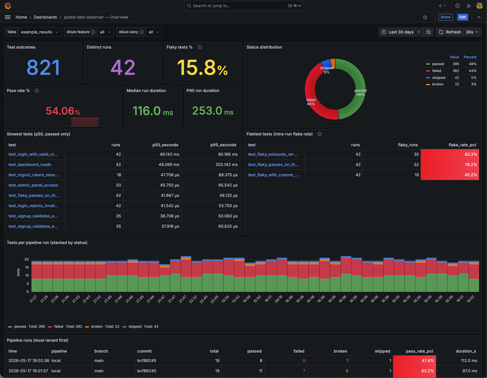

# pytest-test-observer

An easy-to-use pytest plugin to take your test observability to the next level. Compatible with `allure-pytest`.



## Install

### PyPI

```bash
pip install pytest-test-observer==0.1.0
```

### From sources

```bash
uv add --editable git+https://github.com/shakhov-dmitrii/pytest-test-observer
# or for development inside a clone:
uv sync
```

For Allure support, install the extra:

```bash
uv add "pytest-test-observer[allure]"
```

## Quick start

1. Start a local ClickHouse **and Grafana**:

   ```bash
   docker compose up -d
   ```

   This brings up:
   - ClickHouse on <http://localhost:8123> (HTTP) and `:9000` (native)
   - Grafana on <http://localhost:3000> (login: `admin` / `admin`) with the ClickHouse datasource auto-provisioned and a starter dashboard pre-loaded.

2. Run your tests with the ClickHouse URL:

   ```bash
   pytest --ch-url=localhost:8123 --ch-table=pytest_results
   ```

3. Inspect the rows - either via SQL:

   ```bash
   docker exec -it pytest-test-observer-clickhouse clickhouse-client \
     -q "SELECT nodeid, status, duration, ci_provider FROM default.pytest_results ORDER BY timestamp DESC LIMIT 20 FORMAT PrettyCompact"
   ```

   or in the dashboard: <http://localhost:3000/d/pytest-test-observer-overview>

If `--ch-url` is not provided, it does nothing and adds no overhead.

## Configuration

Every connection setting can be supplied three ways, resolved in this order (highest priority first):

1. **CLI flag** - `pytest --ch-url=...`
2. **Environment variable** - `PYTEST_OBSERVER_CH_URL=...`
3. **pyproject.toml** - `ch_url = "..."` under `[tool.pytest.ini_options]` (or any other pytest config file)
4. Built-in default

| CLI flag           | Env var                          | Ini key (`pyproject.toml`) | Default          |
| ------------------ | -------------------------------- | -------------------------- | ---------------- |
| `--ch-url`         | `PYTEST_OBSERVER_CH_URL`         | `ch_url`                   | none             |
| `--ch-user`        | `PYTEST_OBSERVER_CH_USER`        | `ch_user`                  | `default`        |
| `--ch-password`    | `PYTEST_OBSERVER_CH_PASSWORD`    | `ch_password`              | `""`             |
| `--ch-db`          | `PYTEST_OBSERVER_CH_DB`          | `ch_db`                    | `default`        |
| `--ch-table`       | `PYTEST_OBSERVER_CH_TABLE`       | `ch_table`                 | `pytest_results` |
| `--ch-send-from`   | `PYTEST_OBSERVER_CH_SEND_FROM`   | `ch_send_from`             | `any`            |
| `--ch-auto-migrate`| `PYTEST_OBSERVER_CH_AUTO_MIGRATE`| `ch_auto_migrate`          | `true`           |

### `--ch-send-from`: where rows come from

- `any` (default) - send for both local and CI runs.
- `ci` - only send when a provider-specific CI sentinel is set (`GITHUB_ACTIONS`, `GITLAB_CI`, `CIRCLECI`, or `JENKINS_URL`).

### `--ch-auto-migrate`: schema migrations across plugin versions

When a new plugin version adds columns, the plugin auto-applies `ALTER TABLE ... ADD COLUMN IF NOT EXISTS` for each missing column. Existing rows get the column's default value. Old data doesn't change.

If your team's policy forbids the plugin running DDL, set `ch_auto_migrate = false` in `pyproject.toml` (or the env / CLI equivalent). The plugin will then refuse to migrate and surface the SQL you'd need to run yourself.

### Example: defaults into `pyproject.toml`

```toml
[tool.pytest.ini_options]
ch_url   = "clickhouse.internal:8123"
ch_db    = "ci_metrics"
ch_table = "pytest_results"
```

Then a plain `pytest` picks them up - no flags, no env vars.

### Example: CI secret via env var

```yaml
# GitHub Actions
- run: pytest
  env:
    PYTEST_OBSERVER_CH_URL: ${{ secrets.CLICKHOUSE_URL }}
    PYTEST_OBSERVER_CH_PASSWORD: ${{ secrets.CLICKHOUSE_PASSWORD }}
```

### Other environment variables

| Variable                    | Effect                                                           |
| --------------------------- | ---------------------------------------------------------------- |
| `PYTEST_OBSERVER_RUN_ID`    | Override the auto-generated `run_id` (UUID) for the session      |
| `XDG_CACHE_HOME`            | Base directory for the disk-buffer fallback                      |

## ClickHouse schema

The table is auto-created on first flush:

```sql
CREATE TABLE IF NOT EXISTS pytest_results (
    run_id             String,
    timestamp          DateTime64(3),
    started_at         UInt64,
    finished_at        UInt64,
    nodeid             String,
    status             LowCardinality(String),
    when_phase         LowCardinality(String),
    duration           Float64,
    markers            Array(String),
    worker_id          LowCardinality(String),
    ci_provider        LowCardinality(String),
    ci_run_id          String,
    git_commit         String,
    git_branch         String,
    allure_id          String,
    allure_title       String,
    allure_severity    LowCardinality(String),
    allure_labels      Map(String, Array(String)),
    allure_links       Array(Tuple(String, String, String))
) ENGINE = MergeTree
ORDER BY (nodeid, timestamp)
PARTITION BY toYYYYMM(timestamp);
```

## Allure compatibility

When `allure-pytest` is installed and tests use the standard Allure decorators, the plugin captures:

- Labels (`@allure.feature`, `@allure.story`, `@allure.tag`, `@allure.severity`, `@allure.id`, `@allure.epic`, `@allure.suite`, ...) -> `allure_labels`
- Links (`@allure.link`, `@allure.issue`, `@allure.testcase`) -> `allure_links`
- `@allure.title(...)` -> `allure_title`
- `@allure.severity(...)` -> `allure_severity` (also stored in `allure_labels`)
- `@allure.id(...)` -> `allure_id`

## CI / git context detection

Detected automatically.

| Provider       | Env vars used                                                                        |
| -------------- | -------------------------------------------------------------------------------------|
| GitHub Actions | `GITHUB_ACTIONS`, `GITHUB_RUN_ID`, `GITHUB_SHA`, `GITHUB_HEAD_REF`/`GITHUB_REF_NAME` |
| GitLab CI      | `GITLAB_CI`, `CI_PIPELINE_ID`, `CI_COMMIT_SHA`, `CI_COMMIT_REF_NAME`                 |
| CircleCI       | `CIRCLECI`, `CIRCLE_BUILD_NUM`, `CIRCLE_SHA1`, `CIRCLE_BRANCH`                       |
| Jenkins        | `JENKINS_URL`, `BUILD_ID`/`BUILD_NUMBER`, `GIT_COMMIT`, `GIT_BRANCH`                 |
| Local          | `git rev-parse HEAD` and `git rev-parse --abbrev-ref HEAD` (`ci_provider="local"`)   |

## Disk buffer fallback

When ClickHouse is unreachable, slow, or rejects the insert, the batch is written to:

```
$XDG_CACHE_HOME/pytest-test-observer/<run_id>.jsonl   # or ~/.cache/... if unset
```

One JSON object per line, keys identical to the ClickHouse columns. The plugin emits a `warnings.warn` with the path. **The pytest exit code is unaffected.**

### Replaying buffered files back into ClickHouse

Once ClickHouse is reachable again, run:

```bash
python -m pytest_test_observer.replay --ch-url=localhost:8123
# or pick specific files:
python -m pytest_test_observer.replay /path/to/run-abc.jsonl
# or just see what would happen:
python -m pytest_test_observer.replay --dry-run
```

All the `PYTEST_OBSERVER_CH_*` env vars from the configuration table are honoured by the replay tool too.

## Example queries

```sql
-- Top 10 flakiest tests in the last 30 days
SELECT
    nodeid,
    countIf(status IN ('failed','broken')) AS non_passes,
    count() AS total,
    non_passes / total AS flakiness
FROM pytest_results
WHERE timestamp > now() - INTERVAL 30 DAY
GROUP BY nodeid
HAVING total >= 10 AND non_passes > 0
ORDER BY flakiness DESC
LIMIT 10;

-- Slowest 10 tests (median duration)
SELECT nodeid, quantileExact(0.5)(duration) AS p50_seconds, count() AS runs
FROM pytest_results
WHERE timestamp > now() - INTERVAL 7 DAY AND status = 'passed'
GROUP BY nodeid
ORDER BY p50_seconds DESC
LIMIT 10;
```

## License

This project is licensed under the MIT License.
See the LICENSE file for details.
